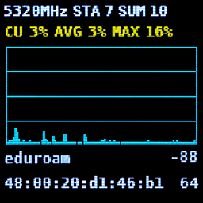

# WLANPi Beacon Live

WLANPi Beacon Live is a live 802.11 beacon and channel analyzer for WLAN Pi
hardware. It listens on one 20 MHz channel in monitor mode and shows a rolling
two-minute view of AP-advertised channel utilization, admission capacity,
station counts, channel composition, and retry percentage.

The app automatically chooses the BSSID used for each display. You select only
the band and channel, not an SSID or BSSID.



## Requirements

The primary target is a WLAN Pi R4 running WLAN Pi OS with:

- WLAN Pi FPMS 2.x and its supported 128×128 display/control stick;
- Python 3.9 or newer;
- a monitor-mode-capable Wi-Fi interface named `wlan0`;
- `git`, `ip`, `iw`, and `tshark`; and
- root access through `sudo`.

The adapter, driver, and regulatory domain must permit the selected channel.
Some adapters do not expose usable local survey counters, but beacon-based
screens can still work.

On Debian-based systems, missing command-line packages can be installed with:

```bash
sudo apt update
sudo apt install python3 python3-venv git iproute2 iw tshark wireshark-common
```

See [Troubleshooting](docs/troubleshooting.md) for hardware and setup checks.

## Install on WLAN Pi

```bash
git clone https://github.com/Yanzzee/WLANPi-Utilization.git
cd WLANPi-Utilization
sudo ./scripts/install_wlanpi_fpms.sh
```

The installer creates an isolated app environment under
`/opt/wlanpi-beacon-live`, adds `Utilization` to the FPMS Apps menu, creates the
runtime and log directories, and restarts `wlanpi-fpms`.

Rerun the installer after updating this repository or upgrading FPMS.

## Run from the front panel

Open:

```text
Apps
  Utilization
    <band>
      <channel and center frequency>
        Display | Display + Log | Start Logging | Stop Logging
```

- `Display` starts capture and the graphical screens without writing logs.
- `Display + Log` starts the same display with CSV and JSONL logging enabled.
- `Start Logging` captures and logs in the background without opening a graph.
- `Stop Logging` stops the background logging session.

While a display is open:

- move up or down to cycle through the five screens;
- press left to stop capture and return to the menu;
- the first two auxiliary buttons are disabled; and
- the third auxiliary button saves the current screen as a timestamped PNG in
  `/var/log/wlanpi-beacon-live`.

Changing screens never restarts capture or clears graph history.

## Screens

| Screen | What it shows |
| --- | --- |
| Utilization | Channel utilization advertised by the automatically selected QBSS BSSID. |
| Admission | The selected BSSID's advertised admission capacity as a percentage. |
| Stations | The sum of AP-advertised QBSS station counts and the BSSID reporting the highest count. |
| Retries | The one-second retry percentage for eligible frames heard on the channel and the BSSID with the most retries. |
| Composition | BSSID and QBSS counts plus best-effort physical-radio, AP name, and vendor information. |

Graphs retain the latest 120 seconds. Missing or unavailable measurements are
shown as gaps or `--`. AP-advertised station counts are not observed-client
counts, and AP QBSS utilization is separate from optional local survey
utilization.

See the [screen reference](docs/screens.md) for metric definitions, selection
rules, and display details.

## Logging

Front-panel logs are written under `/var/log/wlanpi-beacon-live`. A logging
session can write per-second statistics as CSV and valid beacon records as
JSONL.

Logging checks free space every 30 seconds, stops below 256 MiB free, and adds
an end-of-log marker explaining the disk-pressure stop. Long-running sessions
roll to a new file pair every hour. If low disk stops logging while the display
is active, capture, analysis, and graph history continue. Logging-only mode
exits cleanly.

See the [logging reference](docs/logging.md) for formats, filenames, rollover,
markers, and configurable CLI limits.

## Command-line use

The CLI supports live terminal capture, logging-only capture, hardware-free TSV
replay, and retry auditing from PCAP/PCAPNG files.

For a local development or CLI install:

```bash
python3 -m venv .venv
source .venv/bin/activate
python -m pip install -e '.[dev]'
```

Examples:

```bash
# Live terminal display on channel 36
sudo .venv/bin/wlanpi-beacon-live --iface wlan0 --channel 36

# Background-style logging without rendering
sudo .venv/bin/wlanpi-beacon-live --iface wlan0 --channel 36 \
  --logging-only --log-dir logs

# Replay the included hardware-free sample
.venv/bin/beacon-live replay --input samples/tshark_qbss_sample.tsv
```

Use `--frequency-mhz` for an explicit center frequency, or combine `--band`
and `--channel` when a channel number is ambiguous across bands. Run
`beacon-live live --help` for all live options.

## Documentation

- [Architecture](docs/architecture.md) — design rules, pipeline, data flow, and
  Phase 1–5 history.
- [Screen reference](docs/screens.md) — screen metrics, navigation, BSSID
  selection, retry rules, and radio grouping.
- [Logging reference](docs/logging.md) — logging modes, formats, disk safety,
  and rollover.
- [Troubleshooting](docs/troubleshooting.md) — installation, capture, display,
  and metric issues.
- [Development](docs/development.md) — repository layout, setup, tests, replay,
  and contribution guidance.
- [Pi testing](docs/pi_testing.md) — detailed hardware smoke tests, retry
  audits, and on-device acceptance checks.
