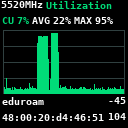
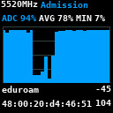
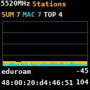
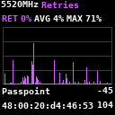
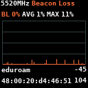
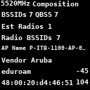

# WLANPi Beacon Live

WLANPi Beacon Live is a live 802.11 beacon and channel analyzer for WLAN Pi
hardware. It uses one fixed capture definition for the run: 20 MHz by default
on 2.4 GHz and 80 MHz by default on 5 GHz and 6 GHz. Advertised HT/VHT/HE/EHT
operation information scopes retry metrics to BSSIDs using the selected primary
channel. The application shows a rolling two-minute view of AP-advertised
channel utilization, admission capacity, station counts, channel composition,
and retry percentage.

The app automatically chooses the BSSID used for each display. You select only
the band and channel, not an SSID or BSSID.








## Requirements

The primary target is a WLAN Pi R4 running WLAN Pi OS with:

- WLAN Pi FPMS 2.x and its supported 128×128 display/control stick;
- Python 3.9 or newer;
- a monitor-mode-capable Wi-Fi interface named `wlan0`;
- `git`, `ip`, `iw`, and `tshark`; and
- root access through `sudo`.

The adapter, driver, and regulatory domain must permit the selected channel
definition, not only its primary frequency. The application checks `iw phy`,
reads the actual configured definition back from `iw`, and reports a clear
error or a one-time 20 MHz fallback when the default 80 MHz definition cannot
be used.
Some adapters do not expose usable local survey counters, but beacon-based
screens can still work.

On Debian-based systems, missing command-line packages can be installed with:

```bash
sudo apt update
sudo apt install python3 python3-venv git iproute2 iw tshark wireshark-common
```

See [Troubleshooting](docs/troubleshooting.md) for hardware and setup checks.

## Install on WLAN Pi

```bash
git clone https://github.com/Yanzzee/WLANPi-Utilization.git
cd WLANPi-Utilization
sudo ./scripts/install_wlanpi_fpms.sh
```

The installer creates an isolated app environment under
`/opt/wlanpi-beacon-live`, adds `Utilization` to the FPMS Apps menu, creates the
runtime and log directories, installs the system-wide `wlanpi-beacon-live` and
`beacon-live` commands, and restarts `wlanpi-fpms`. The commands are launchers
in `/usr/local/bin` that run the existing executables in the isolated app
environment; the installer does not copy the application into the system
Python environment.

Rerun the installer after updating this repository or upgrading FPMS. It
safely refreshes its managed CLI launchers as well as the application and FPMS
integration.

## Use the FPMS front panel

Open:

```text
Apps
  Utilization
    <band>
      <channel and center frequency>
        Display | Display + Log | Start Logging | Stop Logging
```

- `Display` starts capture and the graphical screens without writing logs.
- `Display + Log` starts the same display with CSV and JSONL logging enabled.
- `Start Logging` captures and logs in the background without opening a graph.
- `Stop Logging` stops the background logging session.

Logging start/stop messages briefly show the tuned channel, frequency, and log
folder. `Display + Log` shows the same information when it starts and when you
exit left.

While a display is open:

- move up or down to cycle through the six screens;
- press left to stop capture and return to the menu;
- the first two auxiliary buttons are disabled; and
- the third auxiliary button saves the current screen as a timestamped PNG in
  `/var/log/wlanpi-beacon-live`, then briefly confirms the folder without
  changing the active screen.

Changing screens never restarts capture or clears graph history.

## Use the command line

The normal FPMS installation makes both CLI commands available system-wide:

- `wlanpi-beacon-live` runs live capture directly; and
- `beacon-live` provides the `live`, `replay`, and `retry-debug` workflows.

Live capture configures the wireless interface, tunes it, and starts TShark,
so it normally requires `sudo`. Replay and help do not require root. Writing
to `/var/log/wlanpi-beacon-live` also requires appropriate permissions, which
the examples below obtain with `sudo`.

```bash
# Live terminal display on channel 36
sudo wlanpi-beacon-live --iface wlan0 --channel 36

# Logging-only capture (both CSV and JSONL, with no display rendering)
sudo wlanpi-beacon-live --iface wlan0 --channel 36 \
  --logging-only --log-dir /var/log/wlanpi-beacon-live

# Interactive display plus both log formats
sudo wlanpi-beacon-live --iface wlan0 --channel 36 \
  --log --log-dir /var/log/wlanpi-beacon-live

# Hardware-free replay of the included sample (run from the repository)
beacon-live replay --input samples/tshark_qbss_sample.tsv

# Explicit 6 GHz center frequency instead of band/channel mapping
sudo wlanpi-beacon-live --iface wlan0 --frequency-mhz 5975

# Explicit 160 MHz override: primary 5180 MHz, center 5250 MHz
sudo wlanpi-beacon-live --iface wlan0 --frequency-mhz 5180 \
  --channel-width 160 --center-frequency1-mhz 5250

# Save full packets from the exact live-analysis process and a JSON sidecar
sudo wlanpi-beacon-live --iface wlan0 --band 5 --channel 36 \
  --raw-pcapng /tmp/beacon-live-channel36.pcapng

# General and workflow-specific help
wlanpi-beacon-live --help
beacon-live --help
beacon-live live --help
```

`beacon-live live` accepts the same live options as `wlanpi-beacon-live`. Use
`--frequency-mhz` when the exact primary/control frequency is clearest, or combine
`--band` and `--channel` when a channel number is ambiguous across bands.
`--channel-width auto` is the default: 20 MHz on 2.4 GHz and the standard
80 MHz block containing the selected primary on 5 GHz and 6 GHz. The capture
does not retune in response to beacon contents. Explicit widths above 20 MHz
require `--center-frequency1-mhz`; 80+80 also requires
`--center-frequency2-mhz`.

Retry numerator and denominator include only eligible frames associated through
BSSID/TA/RA/SA/DA with a BSSID whose fresh beacon advertises the selected
primary. Frames before that beacon is discovered, unknown associations, stale
definitions, and BSSIDs using a secondary portion as their own primary are
excluded. The result means all valid frames the configured radio, PHY, driver,
and TShark successfully decode—not literally every frame transmitted over RF.

Hardware capture capability can be narrower than the channel definition that
`iw` successfully configures. In WLAN Pi testing, an MT7921U could tune an
80 MHz 6 GHz channel but delivered only Null/QoS Null data frames while another
capture device received payload-bearing QoS Data. Treat this as a possible
adapter/driver/firmware limitation, not an application filter; validate retry
coverage with `--raw-pcapng` before relying on that combination.

### Interactive SSH dashboard

When both standard input and output are attached to a terminal, live CLI mode
opens one full-screen `curses` dashboard similar to `top`. It renders directly
from the shared live `MetricsSnapshot`; it does not read CSV or JSONL logs.
The screen contains all five 120-second metric groups, strongest-radio channel
composition, independently selected BSSIDs, and a vertically and horizontally
scrollable per-second table.

An abridged wide-terminal example looks like this:

```text
 5180 MHz | Band 5 GHz | Channel 36 | WLANPi Beacon Live | 120s history | FOLLOW
BSSIDs 8  QBSS 6  Radios 3  Radio BSSIDs 4       Selected BSSIDs
Strongest AP: AP-Lobby  Vendor: Example Vendor  Metric   Value BSSID ...
  # BSSID                RSSI SSID                STA max     17 aa:aa:... -45dBm Alpha
* 1 aa:aa:aa:aa:aa:aa  -45dBm Alpha             RET max     4% aa:aa:... -45dBm Alpha
  2 aa:aa:aa:aa:aa:ab  -47dBm Guest
QBSS CU 62%  ADC 48%  STA 17  RET 4%  LOSS 1%
                                                Logging to logs/beacon_live_..._stats.csv
                                                Logging to logs/beacon_live_..._beacons.jsonl
CU    ▁▂▂▃▄▃▅▆▅▇...                 CU    62%  AVG   44%  MAX   81%
ADC   ▇▇▆▆▅▅▄▄▃▃...                 ADC   48%  AVG   55%  MIN   31%
MAC   ▁▁▁▂▂▁▃▂▂▃...                 SUM    28  MAC     9  TOP    17
LOSS  ▁▁▁▁▂▁▁▃▁▁...                 BL      1%  AVG    2%  MAX    8%
STA   ▂▂▃▃▃▄▄▄▄▅...                 SUM    28  MAC     9  TOP    17
RET   ▁▁▂▁▁▃▂▁▁▂...                 RET     4%  AVG    3%  MAX   11%
TIME     BSSIDS STA_SUM CLIENT CU% ... SSID                 QBSS_BSSID
14:30:05 8      28      3      62.0 ... Alpha                aa:aa:aa:aa:aa:aa
```

All BSSID/SSID pairs assigned to the strongest estimated radio are shown at
once. The `*` row is the selected QBSS source; its BSSID and SSID are bold in
the live terminal, and its available CU, ADC, station, retry, and beacon-loss
values appear together below the radio list. The right column identifies the
BSSIDs independently selected for the highest station count and retry value.
The station selection compares each BSSID's latest advertised QBSS count with
its rolling observed client-MAC count; QBSS wins an equal-count tie.

Controls:

- Up/Down scroll the table one row; Page Up/Down scroll one visible page.
- Home jumps to the oldest retained row; End resumes following the newest row.
- Left/Right scroll the wide `SecondStats` table horizontally.
- Space pauses or resumes dashboard updates. Capture, analysis, and logging
  continue while paused; resuming jumps directly to the current snapshot.
- `q` or Ctrl-C exits capture cleanly.
- Terminal resizing is detected automatically and immediately recalculates the
  layout.

The table follows each new second until you scroll upward or press Home. The
graphs always represent the entire retained history: on narrow terminals,
adjacent samples are compressed into the available columns instead of dropping
the latest data. Once all 120 history columns fit, each graph's summary follows
the graph directly instead of being pushed to the terminal's right edge. A
terminal around 120×30 or larger is recommended for the
side-by-side identity columns. Below 112 columns they stack vertically. A
24×15 terminal can show one strongest-radio BSSID with compact graphs and a
table row; each additional BSSID requires another row. Smaller windows show a
resize prompt.

Multiword table headers use underscores. Raw QBSS CU, Retry-bit-readable frame
count, and selected beacon rate remain in the analyzer state but are omitted
from the scrolling display table. The CSV retains retry-observed and selected
beacon-rate fields and also records the top station count, whether its source
was `qbss` or `mac`, and its SSID/BSSID.

If the command is piped, redirected, run without a TTY, or Python lacks
`curses`, Beacon Live uses the existing plain renderer. This also keeps
automated invocations usable. Logging remains independent in either display
mode: `--log` enables both formats alongside the interactive TUI,
and the TUI shows each active output path below `Selected BSSIDs`.
`--stats-csv` and `--beacons-jsonl` remain available when only one format is
wanted, while `--logging-only` writes both formats without starting any
terminal dashboard.

For troubleshooting, the system launchers and their isolated targets are:

```text
/usr/local/bin/wlanpi-beacon-live -> /opt/wlanpi-beacon-live/bin/wlanpi-beacon-live
/usr/local/bin/beacon-live        -> /opt/wlanpi-beacon-live/bin/beacon-live
/opt/wlanpi-beacon-live/bin/python
/opt/wlanpi-beacon-live/lib/python*/site-packages/beacon_live
```

The arrows describe which executable each launcher invokes; the launchers are
small managed shell scripts, not filesystem symlinks. You can bypass the PATH
launcher while diagnosing an installation with, for example,
`/opt/wlanpi-beacon-live/bin/beacon-live --help`.

## Screens

| Screen | What it shows |
| --- | --- |
| Utilization | Channel utilization advertised by the automatically selected QBSS BSSID. |
| Admission | The selected BSSID's advertised admission capacity as a percentage. |
| Stations | AP-advertised QBSS station counts plus unique client MACs observed in BSSID-linked data frames. |
| Retries | The one-second retry percentage for eligible frames heard on the channel and the BSSID with the most retries. |
| Beacon Loss | Percentage of phase-aware expected beacons not received across all BSSIDs on the strongest estimated radio. |
| Composition | BSSID and QBSS counts plus best-effort physical-radio, `AP` (vendor AP-name), and vendor information. |

Graphs retain the latest 120 seconds. Missing or unavailable measurements are
shown as gaps or `--`. On Stations, the amber series is the AP-advertised QBSS
sum and the cyan overlay is the unique client-MAC count detected in each
second. `MAC` is the deduplicated client total for the full rolling window;
it remains separate from the advertised station count. AP QBSS utilization is
also separate from optional local survey utilization.

See the [screen reference](docs/screens.md) for metric definitions, selection
rules, and display details.

## Logging

Front-panel logs are written under `/var/log/wlanpi-beacon-live`. A logging
session can write per-second statistics as CSV and valid beacon records as
JSONL.

Logging checks free space every 30 seconds, stops below 256 MiB free, and adds
an end-of-log marker explaining the disk-pressure stop. Long-running sessions
roll to a new file pair every hour. If low disk stops logging while the display
is active, capture, analysis, and graph history continue. Logging-only mode
exits cleanly.

See the [logging reference](docs/logging.md) for formats, filenames, rollover,
markers, and configurable CLI limits.

## Development environment

The repository `.venv` workflow is only for development and testing; it is
separate from the supported `/opt/wlanpi-beacon-live` installation used by
FPMS and the system-wide commands.

```bash
python3 -m venv .venv
source .venv/bin/activate
python -m pip install -e '.[dev]'
.venv/bin/beacon-live replay --input samples/tshark_qbss_sample.tsv
.venv/bin/python -m pytest -q
```

## Documentation

- [Architecture](docs/architecture.md) — design rules, pipeline, data flow, and
  Phase 1–5 history.
- [Screen reference](docs/screens.md) — screen metrics, navigation, BSSID
  selection, retry rules, and radio grouping.
- [Logging reference](docs/logging.md) — logging modes, formats, disk safety,
  and rollover.
- [Troubleshooting](docs/troubleshooting.md) — installation, capture, display,
  and metric issues.
- [Development](docs/development.md) — repository layout, setup, tests, replay,
  and contribution guidance.
- [Pi testing](docs/pi_testing.md) — detailed hardware smoke tests, retry
  audits, and on-device acceptance checks.
